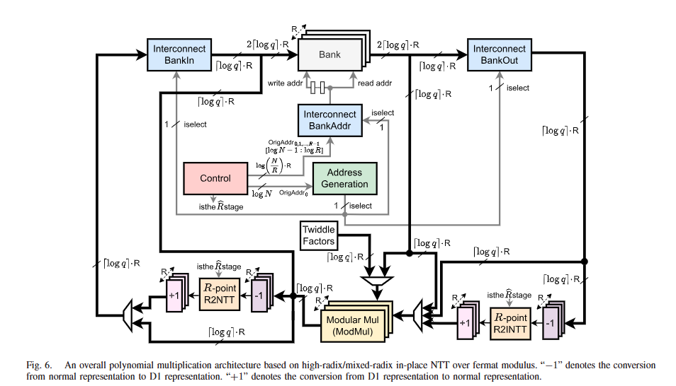
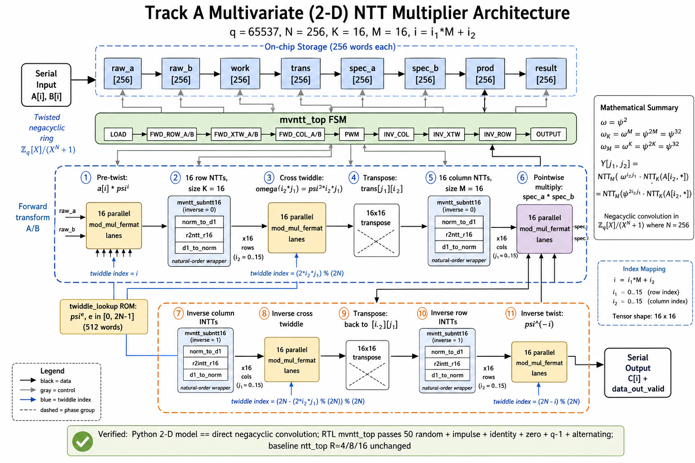

# MVNTT Track A (2-D NTT) - Simple Overview

This README explains, in a simple and intuitive way:

1. What the original multiplier (`ntt_top`) does
2. What the new multivariate Track A multiplier (`mvntt_top`) does
3. Why the new design is important for research

Target configuration (current prototype):

- Modulus: `q = 65537`
- Transform length: `N = 256`
- 2-D split: `K = 16`, `M = 16` (so `N = K * M`)
- Index map: `i = i1*M + i2`

---

## 1) Original Architecture (Monolithic NTT Multiplier)

The original design is implemented in:

- `rtl/ntt_top.v`

Intuition:

- Think of it as **one big transform pipeline** operating on polynomials `A[i]` and `B[i]`.
- It uses a banked memory + address mapping + twiddle ROM to run:

`LOAD → NTT(A) → NTT(B) → PWM → INTT → OUTPUT`

Key strengths:

- Compact, well-optimized control for the chosen radix (`R=4/8/16` in this repo)
- Great baseline for correctness and performance at `N=256`

Reference diagram (original repo diagram):

---

## 2) New Architecture (Track A Multivariate / 2-D NTT Multiplier)

The new design is implemented in:

- `rtl/mvntt_top.v`
- `rtl/mvntt_subntt16.v`

Intuition:

- It computes the **same final polynomial product**, but it changes *how the transform is scheduled*.
- Instead of treating the NTT as one long 1-D schedule, it uses a **2-D Cooley-Tukey schedule**:

`(16 row NTTs) + (cross-twiddle) + (transpose) + (16 column NTTs)`

This makes the “hard parts” explicit:

- **Permutation / transpose cost**
- **Cross-twiddle cost**
- **Control/scheduling cost**

Those costs are exactly what determine whether multivariate ideas are worth it at large `N`.

MVNTT diagram (Track A implemented pipeline):

---

## 3) What Each Component Does (Practical View)

The MVNTT implementation is split into a small set of reusable blocks.

### Top-level RTL blocks

- `mvntt_top` (`rtl/mvntt_top.v`)
  - The main controller + datapath for the Track A 2-D schedule.
  - Reads serial coefficients, runs the forward transforms of A and B, performs
    pointwise multiply, runs the inverse transform, and streams the final output.
  - It explicitly exposes the stages that are often “hidden” in monolithic NTT
    implementations: cross-twiddle and transpose.

- `mvntt_subntt16` (`rtl/mvntt_subntt16.v`)
  - A clean 16-point NTT/INTT wrapper.
  - Internally uses `norm_to_d1`, the existing `r2ntt_r16` / `r2intt_r16`, and
    `d1_to_norm`.
  - Important detail: `r2ntt_r16` produces bit-reversed lane order; the wrapper
    reorders lanes so `mvntt_top` can treat the 16-point kernel as natural-order
    input and natural-order output.

### Twiddles and modular multiplication

- `twiddle_lookup` (`rtl/twiddle_rom.v`)
  - Reads `twiddle_factors.hex` and outputs `psi^e` (mod q) for an exponent index
    `e` in `[0, 2N-1]`.
  - MVNTT uses this for:
    - twist: `psi^i`
    - untwist: `psi^(-i)`
    - cross-twiddle: `omega^(i2*j1) = psi^(2*i2*j1)` and its inverse

- `mod_mul_fermat` (`rtl/mod_mul_fermat.v`)
  - Computes `(a * b) mod (2^B + 1)` in normal representation.
  - MVNTT instantiates 16 lanes in parallel (one per row/column element) for:
    - twist/untwist multiplies
    - cross-twiddle multiplies
    - pointwise multiply (PWM)

### Internal storage (the “memories” inside mvntt_top)

`mvntt_top` uses arrays as architectural storage (think “SRAM blocks” in a real
implementation):

- `raw_a[256]`, `raw_b[256]`: input coefficients
- `work[256]`: scratch for row/column outputs
- `trans[256]`: scratch used for transpose-reordered data
- `spec_a[256]`, `spec_b[256]`: forward-transformed A and B (frequency domain)
- `prod[256]`: pointwise product in frequency domain
- `result[256]`: final coefficients in normal domain, streamed during OUTPUT

---

## 4) How the Output Is Computed (Step-by-Step)

### 4.1 The math goal

We compute negacyclic polynomial multiplication:

- `C(X) = A(X) * B(X) mod (X^N + 1) mod q`

### 4.2 Why the twist exists

Negacyclic rings `(X^N + 1)` are handled using a standard "twisted" NTT:

- Let `psi` be a primitive `2N`-th root of unity mod q
- Let `omega = psi^2` (an `N`-th root)

Then:

1. Twist inputs:
   - `a'[i] = a[i] * psi^i`
   - `b'[i] = b[i] * psi^i`
2. Compute normal `N`-point NTTs using `omega`:
   - `A_hat = NTT(a')`
   - `B_hat = NTT(b')`
3. Pointwise multiply:
   - `C_hat[k] = A_hat[k] * B_hat[k]`
4. Inverse NTT:
   - `c' = INTT(C_hat)`
5. Untwist output:
   - `c[i] = c'[i] * psi^(-i)`

MVNTT does exactly this, but computes the NTT/INTT using a 2-D schedule.

### 4.3 2-D indexing used in this implementation

We split `N = K*M` with `K=16`, `M=16`, and map 1-D indices to 2-D as:

- `i = i1*M + i2`
- `i1 in [0..K-1]` (X1 / row dimension)
- `i2 in [0..M-1]` (X2 / column dimension)

This is only a reshape; no coefficients are duplicated.

### 4.4 Forward transform of A (same steps are repeated for B)

MVNTT forward transform is done in three phases:

1. **Row phase (FWD_ROW_A)**
   - Fix a row index `i2`.
   - Build a 16-lane row vector:
     - `row[i1] = raw_a[i1*M + i2]`
   - Twist each lane by `psi^(i1*M + i2)`.
   - Run a 16-point NTT on the row (`mvntt_subntt16`).
   - Store results in `work[i2*K + j1]` (where `j1` is the row-frequency index).

2. **Cross-twiddle + transpose (FWD_XTW_A)**
   - Multiply each row output by the cross twiddle:
     - `omega^(i2*j1) = psi^(2*i2*j1)`
   - Write into transposed layout:
     - `trans[j1*M + i2]` (this is the “transpose” stage).

3. **Column phase (FWD_COL_A)**
   - Fix a column index `j1`.
   - Read 16 contiguous values `trans[j1*M + i2]` (for all `i2`).
   - Run a 16-point NTT on that column (`mvntt_subntt16`).
   - Store results in `spec_a[j1*M + j2]`.

After this, `spec_a[]` is the forward transformed representation of A used for
pointwise multiplication.

### 4.5 Pointwise multiply (PWM)

- `prod[k] = spec_a[k] * spec_b[k] mod q`

This is where multiplication becomes “easy”: one modular multiply per element.

### 4.6 Inverse transform + output

The inverse runs the exact reverse schedule:

1. **INV_COL**
   - Inverse 16-point INTTs along columns on `prod` (store to `work`).

2. **INV_XTW**
   - Multiply by inverse cross twiddle `omega^(-i2*j1)`.
   - Transpose back into `trans` so row data becomes contiguous again.

3. **INV_ROW**
   - Inverse 16-point INTTs along rows.
   - Untwist each coefficient by multiplying `psi^(-i)`.
   - Store final coefficients in `result[i]`.

4. **OUTPUT**
   - Stream `result[0..N-1]` on `data_out` with `data_out_valid`.

---

## 5) What Problem MVNTT Is Solving (Why This Is Useful)

Even if the butterfly math is “easy”, large NTT multipliers become difficult in
hardware because:

- permutations / transposes dominate memory traffic
- twiddle distribution becomes heavy (ROM size + bandwidth)
- banking and conflict-free addressing gets complex
- control/FSM complexity grows

The MVNTT Track A pipeline makes those overheads explicit stages:

- row NTTs
- cross-twiddle
- transpose
- column NTTs

So you can measure and optimize them directly. This is exactly what you need
before attempting the frontier Track B ring-embedding idea (Kim et al. style),
where mapping/folding costs can make or break the approach.

---

## 6) How to Read the MVNTT Diagram (Simple Walkthrough)

In `mvntt_top`, the pipeline is explicitly staged:

1. **LOAD**
   - Stream `A[i]`, `B[i]` into `raw_a[]`, `raw_b[]`
2. **Forward transform of A**
   - **Pre-twist**: multiply by `psi^i` (handles the negacyclic `(X^N + 1)` ring)
   - **Row NTTs**: 16 small NTTs of length `K=16`
   - **Cross twiddle**: multiply by `omega^(i2*j1) = psi^(2*i2*j1)`
   - **Transpose**: write with swapped indices (`trans[j1][i2]`)
   - **Column NTTs**: 16 small NTTs of length `M=16`
3. **Forward transform of B**
   - Same phases as A
4. **PWM (Pointwise Multiply)**
   - Multiply transformed `A` and `B` coefficient-wise
5. **Inverse transform**
   - Inverse column transforms → inverse cross twiddle → inverse row transforms
   - **Inverse twist**: multiply by `psi^(-i)`
6. **OUTPUT**
   - Stream out `C[i]` with `data_out_valid`

The fixed-size 16-point transform is wrapped by:

- `mvntt_subntt16` (it hides bit-reversal details and provides natural-order I/O)

---

## 4) Why This Matters (Research Significance)

This new Track A design is important because it provides a **working RTL testbed** for multivariate NTT ideas:

- It turns a “paper-level” multidimensional schedule into an **implementable, testable** architecture.
- It makes the true overheads measurable:
  - transpose/permutation
  - cross-twiddles
  - control complexity
- It creates a clean stepping stone toward the harder frontier idea (Track B):
  - Kim et al.-style univariate-to-multivariate **ring embedding** (e.g. `X2 = X1^(K/2)`),
  - which requires extra fold/carry logic and careful mapping proofs.

In short:

- `ntt_top` is a strong baseline monolithic multiplier.
- `mvntt_top` is a research vehicle that exposes the real costs and scaling challenges of multivariate scheduling.

---

## 5) Verification (What Was Checked)

Python model:

- `scripts/mvntt_model.py` verifies Track A 2-D schedule matches direct negacyclic convolution.

RTL regression:

- `sim/run_mvntt_regression.py` runs:
  - 50 random cases
  - impulse, identity, all-zero, all-(q-1), alternating patterns

Baseline guard (unchanged original design):

- `sim/run_regression_matrix.py` still passes `ntt_top` for `R=4/8/16`.

---

## 7) Next Steps (If You Want to Publish This)

To move from a correct prototype to a publication-quality result:

1. Generalize `K` and `M` beyond `16x16`
2. Add explicit banking strategies for transpose (double-buffer vs blocked transpose)
3. Add cycle + memory traffic estimators (and validate against simulation)
4. Compare against `ntt_top` baseline in synthesis/P&R (area, Fmax, BRAM, routing)
5. Implement Track B only after software proof (basis + fold/carry + inverse mapping)
